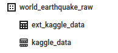
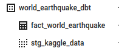

# World earthquake data pipeline

Dataset: https://www.kaggle.com/datasets/garrickhague/world-earthquake-data-from-1906-2022

Dashboard: coming soon!

## About this project
coming soon!

### Pipeline technologies:
Infrastructure as code (IaC): Terraform
Workflow orchestration: Prefect Cloud
Data Lake: Google Cloud Storage
Data Wareshouse: BigQuery
Data transformation: dbt cloud
Other GCP Services: Artifact registory, Secret manager
Python vertual environment: venv (we will use python 3.9)

## Dashboard
You can see the dashboard from here: https://lookerstudio.google.com/reporting/2a7b7ecf-827c-498c-a486-af2cc398711e.

## Set up
### 0. Prepare virtual environment
python 3.9 -m venv venv
pip install -r requirements.txt
source venv/bin/activate

### 1. Create a GCP service account and a key
The service account should have the follwing roles:
- BigQuery Admin
- Storage Admin
- Storage Object Admin
- Secret Manager Secret Accessor
### 2. Terraform
Working directory is `terraform`.
We will create a GCS bucket for data lake and a BigQuery dataset for saving raw data.
#### 2.1. Create a bucket for tsfile
We will save the tfstate file in a GCS bucket, so please create a bucket for that. (Recommend to use object versioning.)
#### 2.2. Create configuration files
Please create `env.tfvars` file and `backend.conf`file from these example files `env.tfvars.example` and `backend.conf.example` and edit them.
#### 2.3. terraform init/plan/apply
```
terraform init -backend-config=backend.conf -var-file=env.tfvars
terraform plan -var-file=env.tfvars
terraform apply -var-file=env.tfvars
```

### 3. Prefect
We will use Prefect Cloud.
Working directory is `prefect`.

#### 3.1. Create a GCP Secret for kaggle.json content
Make GCP Srcrete Manamer (https://cloud.google.com/secret-manage) API avairable and create a secret for Kaggle API.
For examlpe, create a secret with name "kaggle-json" and save the content of the kaggle.json.

#### 3.2. GCP Artifact registory
Make GCP Artifact registory API enable, so that we can save our docker image there.

#### 3.3. Configure environment variables 
Please create `.env` file from this example file `.env.example` and edit it.
Then, export the variables:
```
export $(grep -v '^#' .env | xargs)
```
#### 3.4. Start prefect server
Login to the Prefect cloud. (Assume that you already have a workspace.) 
```
prefect cloud login
```
#### 3.5. Create Prefect blocks
Create GCP credentials, GCP bucket, BigQuery Warehouse, GcpSecret blocks:
```
python blocks/make_gcp_blocks.py 
```
Create a docker block for flows:
```
python blocks/make_docker_block.py 
```
#### 3.6. deployment flows
Build a docker image and and push it to GCP Artifact registory. (probably you need to `gcloud auth configure-docker`): 
```
docker build -t $WORLD_EARTHQUAKE_DOCKER_IMAGE_NAME .
docker push $WORLD_EARTHQUAKE_DOCKER_IMAGE_NAME
```
Run this deoloyment script:
```
python deploy.py
```
Then, you can see the following two deployments on the Prefect Cloud UI page:
1. world-earthquake: load data from Kaggle and upload to GCS/web_to_gcs	
2. world-earthquake: update BigQUery table/gcs_to_bq


#### 3.7. Set PREFECT_API_URL and start agent
Set PREFECT_API_URL if you are using prefect locally. (e.g. local development)
```
prefect config set PREFECT_API_URL=http://127.0.0.1:4200/api
```
#### 3.8. Run prefect agent and the flows 
Run an agent:
```
prefect agent start -p default-agent-pool
```
From the Prefect Cloud UI, run the flow `world-earthquake: load data from Kaggle and upload to GCS/web_to_gcs` then  `world-earthquake: update BigQUery table/gcs_to_bq`.

Then, you can see an external table `ext_kaggle_data` and a partitioned table `kaggle_data` under the dataset `world_earthquake_raw`.


### 4. dbt
Working directory is `dbt`.

#### 4.1. configure dbt

##### (Option 1) use dbt cli and configure profile.yml
If you will use dbt cli, create profile.yml under ~/.dbt and write like this:

```
world_earthquake:
  outputs:
    dev:
      dataset: world_earthquake_dbt_dev
      job_execution_timeout_seconds: 300
      job_retries: 3
      keyfile: /path/to/bigquery/credentials/dev_file.json
      location: EU
      method: service-account
      priority: interactive
      project: <gcp-project-id>
      threads: 4
      type: bigquery
    prod:
      dataset: world_earthquake_dbt
      job_execution_timeout_seconds: 300
      job_retries: 3
      keyfile: /path/to/bigquery/credentials/prod_file.json
      location: EU
      method: service-account
      priority: interactive
      project: <gcp-project-id>
      threads: 4
      type: bigquery
  target: dev
```
##### (Option 2) Use dbt cloud
If you will use dbt colud, create a new project and configure it.
Please don't forget to set sub directory as `dbt`.

#### 4.2. Deployment
```
dbt build --target (dev|prod) --var 'is_test_run: false'
```
This will run tests, create a BigQuery dataset `world_earthquake_dbt`, a view `stg_kaggle_data` and a table `fact_world_earthquake`. 

