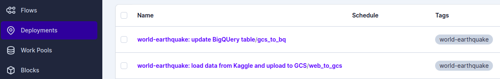
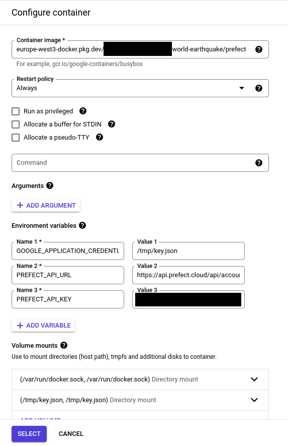

# World earthquake data pipeline

## About this project
In this project, we have constructed a data pipeline and dashboard using the World Earthquake Dataset, which covers data from 1906 to 2022. The dataset contains around 300,000 records of earthquake occurrences, magnitudes, and depths, providing valuable information for those interested in seismology. 

The objective of this project is to organize and analyze earthquake data through the data pipeline, and visualize earthquake-prone regions and other trends by creating a dashboard. By doing so, we aim to identify areas with high earthquake risk and provide information for the consideration of prevention measures and strategies.

## Dataset
https://www.kaggle.com/datasets/garrickhague/world-earthquake-data-from-1906-2022

## Dashboard
You can see the dashboard from here: https://lookerstudio.google.com/reporting/2a7b7ecf-827c-498c-a486-af2cc398711e.


## Technologies
- Infrastructure as code (IaC): Terraform
- Batch / Workflow orchestration: Prefect 2.0
- Data Lake: Google Cloud Storage
- Data Wareshouse: BigQuery
- Data transformation: dbt
- Dashboard: Google Looker Studio
- Other GCP Services: Compute Engine, Container registry, Secret manager
- Python vertual environment: venv (we will use python3.9)


## Set up
### 1. Create a GCP service account and a key
The service account should have the follwing roles:
- BigQuery Admin
- Storage Admin
- Storage Object Admin
- Secret Manager Secret Accessor
### 2. Terraform
Working directory is `terraform`.
We will create a GCS bucket for data lake and a BigQuery dataset for saving raw data, and a vurtual mashine for Prefect/dbt.
#### 2.1 Create a bucket for tsfile
We will save the tfstate file in a GCS bucket, so please create a bucket for that. (Recommend to use object versioning.)
#### 2.2 Create configuration files
Please create `env.tfvars` file and `backend.conf`file from these example files `env.tfvars.example` and `backend.conf.example` and edit them.
#### 2.3 terraform init/plan/apply
```
terraform init -backend-config=backend.conf -var-file=env.tfvars
terraform plan -var-file=env.tfvars
terraform apply -var-file=env.tfvars
```

### 3. Prefect (deploy flows on Prefect Cloud 2.0)
We will use Prefect Cloud 2.0 for prefect server.
Working directory is `prefect`.

#### 3.1 Prepare virtual environment
We need python to deploy flows etc...
```
python3.9 -m venv venv
source venv/bin/activate
pip install -r requirements.txt
```

#### 3.2 Create a GCP Secret for kaggle.json content
Make GCP Srcrete Manager (https://cloud.google.com/secret-manage) API avairable and create a secret for Kaggle API.
For examlpe, create a secret with name "kaggle-json" and save the content of the kaggle.json.

#### 3.3 GCP Container registry
Make GCP Container registry API enable, so that we can save our docker image there.

#### 3.4 Configure environment variables 
Please create `.env` file from this example file `.env.example` and edit it.
Then, export the variables:
```
export $(grep -v '^#' .env | xargs)
```
#### 3.5 Start prefect server
Login to the Prefect cloud. (Assume that you already have a workspace.) 
```
prefect cloud login
```
#### 3.6 Create Prefect blocks
Create GCP credentials, GCP bucket, BigQuery Warehouse, GcpSecret blocks:
```
python blocks/make_gcp_blocks.py 
```
Create a docker block for flows:
```
python blocks/make_docker_block.py 
```
#### 3.7 deployment flows
Build a docker image and and push it to GCP Container registry. (probably you need to `gcloud auth configure-docker`): 
```
docker build -t $WORLD_EARTHQUAKE_DOCKER_IMAGE .
docker push $WORLD_EARTHQUAKE_DOCKER_IMAGE
```
Run this deoloyment script:
```
python deploy.py
```
Then, you can see the following two deployments on the Prefect Cloud UI page:
1. world-earthquake: load data from Kaggle and upload to GCS/web_to_gcs	
2. world-earthquake: update BigQUery table/gcs_to_bq




### 4. Prefect agent
We will run prefect agent using docker.
Working directory is `docker/prefect-agent`.

#### 4.1 Configure environment variables 
Please create `.env` file from this example file `.env.example` and edit it.
Then, export the variables:
```
export $(grep -v '^#' .env | xargs)
```
#### 4.2 Build a docker image
Build a docker image:
```
docker build -t $PREFECT_AGENT_DOCKER_IMAGE .
```
#### 4.3 Start prefect agent using docker
There are two options to run the prefect agent.
1. Run locally (e.g. for development)
2. Run on a VM instance on the GCP Compute Engine

##### Option 1: Run locally (e.g. for development)
Run a docker container locally:
```
docker run -d --name prefect-agent --restart always \
  -v /var/run/docker.sock:/var/run/docker.sock \
  -v $GOOGLE_APPLICATION_CREDENTIALS:/tmp/key.json:ro \
  -e GOOGLE_APPLICATION_CREDENTIALS=/tmp/key.json \
  -e PREFECT_API_URL=$PREFECT_API_URL \
  -e PREFECT_API_KEY=$PREFECT_API_KEY \
  $PREFECT_AGENT_DOCKER_IMAGE
```

##### Option 2: Run on a VM instance on the GCP Compute Engine
Push the docker image to Google Container Registry:
```
docker push $PREFECT_AGENT_DOCKER_IMAGE
```
Follwing this inctruction, create a VM instance running "Container-Optimized OS" on the GCP Compute Engine:
https://cloud.google.com/container-optimized-os/docs/how-to/create-configure-instance

(I tried to do it using terraform, but I have no idea how to create and configure a VM instance running "Container-Optimized OS", so I did it manually.)

Configuration as follws:
- Container image: $PREFECT_AGENT_DOCKER_IMAGE #e.g gcr.io/<project_id>>/<domain>/prefect-agent
- Environment variables:
  - GOOGLE_APPLICATION_CREDENTIALS=/tmp/key.json
  - PREFECT_API_URL
  - PREFECT_API_KEY
- Volume mounts:
  - /var/run/docker.sock:/var/run/docker.sock
  - /tmp/key.json:/tmp/key.json (read only)



And then, start the instance first, after that, send the google credentials key file to the VM (/tmp/key.json) like this:
```
gcloud compute scp $GOOGLE_APPLICATION_CREDENTIALS <user_name>@<vm_instance_name>:/tmp/key.json --zone=<zone_of_vm>
```

Now, prefect agent is ready to work for flows!


#### 4.4 Run the flows on the Prefect Cloud
From the Prefect Cloud UI, run the flow `world-earthquake: load data from Kaggle and upload to GCS/web_to_gcs` then  `world-earthquake: update BigQUery table/gcs_to_bq`.

Then, you can see an external table `ext_kaggle_data` and a partitioned table `kaggle_data` under the dataset `world_earthquake_raw`.


### 5. dbt
Working directory is `dbt`.

#### 5.1 configure dbt

##### (Option 1) use dbt cli and configure profile.yml
If you will use dbt cli, create profile.yml under ~/.dbt and write like this:

```
world_earthquake:
  outputs:
    dev:
      dataset: world_earthquake_dbt_dev
      job_execution_timeout_seconds: 300
      job_retries: 3
      keyfile: /path/to/bigquery/credentials/dev_file.json
      location: EU
      method: service-account
      priority: interactive
      project: <gcp-project-id>
      threads: 4
      type: bigquery
    prod:
      dataset: world_earthquake_dbt
      job_execution_timeout_seconds: 300
      job_retries: 3
      keyfile: /path/to/bigquery/credentials/prod_file.json
      location: EU
      method: service-account
      priority: interactive
      project: <gcp-project-id>
      threads: 4
      type: bigquery
  target: dev
```
##### (Option 2) Use dbt cloud
If you will use dbt colud, create a new project and configure it.
Please don't forget to set sub directory as `dbt`.

#### 5.2 Deployment
```
dbt build --target (dev|prod) --var 'is_test_run: false'
```
This will run tests, create a BigQuery dataset `world_earthquake_dbt`, a view `stg_kaggle_data` and a table `fact_world_earthquake`.


