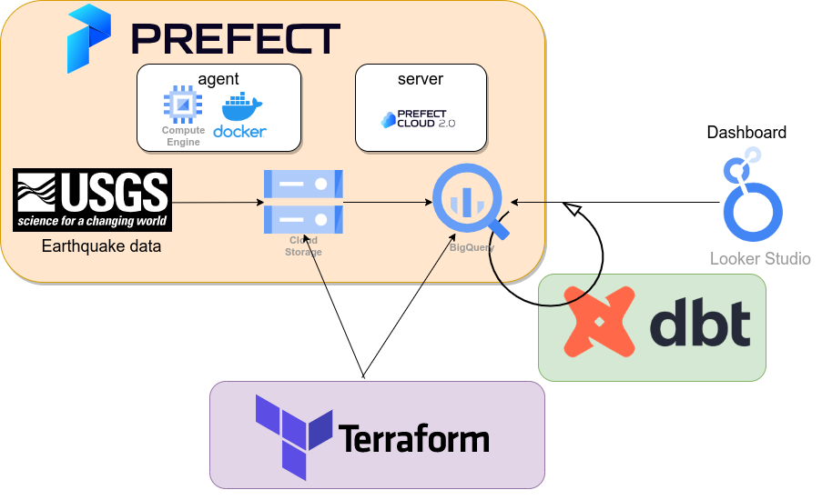

# World earthquake data pipeline

## About this project
This project addresses the lack of accessible earthquake data analysis tools by building a data pipeline and dashboard using the World Earthquake Dataset provided by USGS (United States Geological Survey). 
The dashboard provides an interactive and visually appealing interface for users to filter and analyze earthquake data by time, location, magnitude type, magnitude, and other factors. 

The data pipeline uses Prefect 2.0 and dbt for scalability and future expandability as new data becomes available. Additionally, GCP's cloud environment is utilized for increased reliability and maintenance of the project.

This project was originally created as a capstone project for the Data Engineering Zoomcamp by DataTalks.Club (https://github.com/DataTalksClub/data-engineering-zoomcamp). The initial version utilized a stable dataset found on Kaggle (https://www.kaggle.com/datasets/garrickhague/world-earthquake-data-from-1906-2022) that contained earthquake data up until 2022. This early version of the project can be found at the branch `use-kaggle-data-ver`: https://github.com/hirobo/world-earthquake/tree/use-kaggle-data-ver.

Since then, the project has been modified to incorporate data from the United States Geological Survey (USGS).

## Dataset
https://earthquake.usgs.gov/fdsnws/event/1/

## Dashboard
You can view the dashboard here:

[Coming soon!]


## Technologies
- Infrastructure as code (IaC): Terraform
- Batch / Workflow orchestration: Prefect 2.0
- Data Lake: Google Cloud Storage
- Data Warehouse: BigQuery
- Data transformation: dbt (prefect-dbt)
- Dashboard: Google Looker Studio
- Other GCP Services: Compute Engine, Artifact Registry
- Python 3.9




## Set up
### 1. Create a GCP service account and a key
The service account should have the following roles:
- BigQuery Admin
- Storage Admin
- Storage Object Admin
- Secret Manager Secret Accessor
- Artifact Registry Administrator

### 2. Terraform
Working directory is `terraform`.
We will create the following GCP resources:
- a GCS bucket for data lake 
- a BigQuery dataset for saving the raw data
- an Artifact Registry repository to save Docker images for Prefect flows and Prefect agent.
(Please enable the following APIs: Cloud Storage API, BigQuery API, Artifact Registry API)

We will use (at least) two environments: `dev` and `prod` using terraform workspace.

#### 2.1 Create a bucket for both state files
We will save both `tfstate` files (`dev.tfstate`and `prod.tfstate`) under a GCS bucket, so please create a bucket for that. (We recommend using object versioning.)

#### 2.2 Create configuration files
Please create the following files from these example files: `env.tfvars.example`, `backend.conf.example`, and edit them:
* backend.conf
* env.dev.tfvars
* env.prod.tfvars

#### 2.3 create a workspace, init/plan/apply
For `dev` environment:

Create `dev` workspace:
```
terraform workspace new dev
```

Then you are switch to `dev`. check if current workspace is `dev`:
```
terraform workspace show
```

terraform init/plan/apply
```
terraform init -backend-config=backend.conf -var-file=env.dev.tfvars
terraform plan -var-file=env.dev.tfvars
terraform apply -var-file=env.dev.tfvars
```
Now, a bucket for data lake, a BigQuery dataset for raw data, an Artifact Registry Repository will be created. 

Do the same things for `prod`.

### 3. Prefect (deploy flows on Prefect Cloud 2.0)
We will use Prefect Cloud 2.0 for the Prefect server.

#### 3.0 Configure environment variables
Working directory is the root directory (not `prefect`).

Please create a `.env.(dev|prod)` file from the example file `.env.example` and edit it.
Then, export the variables (e.g. for dev):
```
export $(grep -v '^#' .env.dev | xargs)
```

#### 3.1 Prepare virtual environment
Working directory is `prefect`.
We need Python to deploy flows.
```
python3.9 -m venv venv
source venv/bin/activate
pip install -r requirements.txt
```

#### 3.2 GCP Artifact registry
Enable GCP Artifact Registry API so that we can save our Docker image there.

#### 3.4 Start prefect server
Login to the Prefect cloud. (Assuming you already have a workspace.)
```
prefect cloud login
```
#### 3.5 Create Prefect blocks
Create GCP credentials, GCP bucket, BigQuery Warehouse, and GcpSecret blocks:
```
python blocks/make_gcp_blocks.py 
```
Create blocks for dbt:
```
python blocks/make_docker_block.py 
```
Create a docker block for flows:
```
python blocks/make_docker_block.py 
```

#### 3.6 Build a docker image and push to GCP Artifact registry for flows
Go to the root directory (not `docker/prefect-flows`).
Make sure that the environment variable $WORLD_EARTHQUAKE_FLOWS_DOCKER_IMAGE is loaded.

Build a docker image and push it to GCP Artifact registry. (You may need to `gcloud auth configure-docker europe-west3-docker.pkg.dev --quiet` or something like that.): 
```
docker buildx build -t $WORLD_EARTHQUAKE_FLOWS_DOCKER_IMAGE -f docker/prefect-flows/Dockerfile .
docker push $WORLD_EARTHQUAKE_FLOWS_DOCKER_IMAGE
```

#### 3.7 Deployment flows
Make sure that the environment variable are loaded, then run this deployment script:
```
python prefect/deploy.py
```
Then, you can see the following three deployments on the Prefect Cloud UI page:
1. world-earthquake-pipeline: web_to_gcs_to_bq_all/deploy
2. world-earthquake-pipeline: web_to_gcs_to_bq_daily/deploy	
3. world-earthquake-pipeline: web_to_gcs_to_bq_with_params/deploy
3. world-earthquake-pipeline: trigger_dbt/deploy

The flow `web_to_gcs_to_bq_all` will be run only at the first time to load all data from the year 1958 to yesterday.

The flow `web_to_gcs_to_bq_daily` is scheduled on 5:00 o'clock (UTC) every day to update yesterday's data.

The flow `web_to_gcs_to_bq_with_params` will be used if you want to update data which was not updated because of some errors.

The flow `trigger_dbt` will run `dbt build --target (dev|prod) --vars 'is_test_run: false'` to update BigQuery tables under the following datasets:

* earthquake_(dev|prod)_stg
  * stg_usgs
* earthquake_(dev|prod)_dwh
  * dwh_usgs
* earthquake_(dev|prod)_mart
  * mart_earthquakes


### 4. Prefect agent
We will run the Prefect agent using docker.
Working directory is `docker/prefect-agent`.

#### 4.0 Configure Prefect API key/url on the Secret Manager 
Make GCP Secret Manager (https://cloud.google.com/secret-manage) API available and create two secrets with the following names:
* prefect-api-key-world-earthquake-pipeline: for Prefect API key
* prefect-api-url-world-earthquake-pipeline: for Prefect API url

On creating the secret for the key, I'll recommend to upload the json file than copying the content.
If you want to use other names, please edit the `entrypoint.sh` file.

#### 4.1 Configure environment variables 
Please create `.env` file from this example file `.env.example` and edit it.
Then, export the variables:
```
export $(grep -v '^#' .env | xargs)
```
#### 4.2 Build a docker image
Build a docker image:
```
docker buildx build -t $PREFECT_AGENT_DOCKER_IMAGE .
```
#### 4.3 Start prefect agent using docker
There are two options to run the prefect agent.
1. Run locally (e.g. for development)
2. Run on a VM instance on the GCP Compute Engine

##### Option 1: Run locally
Run a docker container locally:
```
docker run -d --name prefect-agent --restart always \
  -v /var/run/docker.sock:/var/run/docker.sock \
  -v $GOOGLE_APPLICATION_CREDENTIALS:/tmp/key.json:ro \
  -e GOOGLE_APPLICATION_CREDENTIALS=/tmp/key.json \
  -e ARTIFACT_REGISTRY_PROJECT_ID=$ARTIFACT_REGISTRY_PROJECT_ID \
  $PREFECT_AGENT_DOCKER_IMAGE
```

##### Option 2: Run on a VM instance on the GCP Compute Engine
Push the docker image to the Artifact Registry:
```
docker push $PREFECT_AGENT_DOCKER_IMAGE
```
Following this instruction, create a VM instance running "Container-Optimized OS" on the GCP Compute Engine:
https://cloud.google.com/container-optimized-os/docs/how-to/create-configure-instance

Configuration as follows:
- Container image: $PREFECT_AGENT_DOCKER_IMAGE #e.g europe-west3-docker.pkg.dev/<project_id>/world-earthquake-pipeline/prefect-agent
- Environment variables:
  - ARTIFACT_REGISTRY_PROJECT_ID:$ARTIFACT_REGISTRY_PROJECT_ID
- Volume mounts:
  - /var/run/docker.sock:/var/run/docker.sock

And then, start the instance. The prefect agent is ready to work for flows!


#### 4.4 Run the flows on the Prefect Cloud
From the Prefect Cloud UI, run the flow `world-earthquake-pipeline: web_to_gcs_to_bq_all`.
Then, you can see a partitioned table `usgs_data` under the dataset `earthquake_raw`.

The flow `world-earthquake-pipeline: web_to_gcs_to_bq_daily` is scheduled on every 05:00 (UTC) every day to update data in `earthquake_raw` yesterday.

The flow `world-earthquake-pipeline: trigger_dbt` is scheduled on every 05:05 (UTC) every day to update tables under the datasets `earthquake_(dev|prod)_(stg|dwh|mart)` incrementally.

With these steps, your data pipeline is now complete, and you can use the BigQuery table `earthquake_(dev|prod)_mart.mart_earthquake` to create a dashboard to visualize earthquake-prone regions and other trends.
